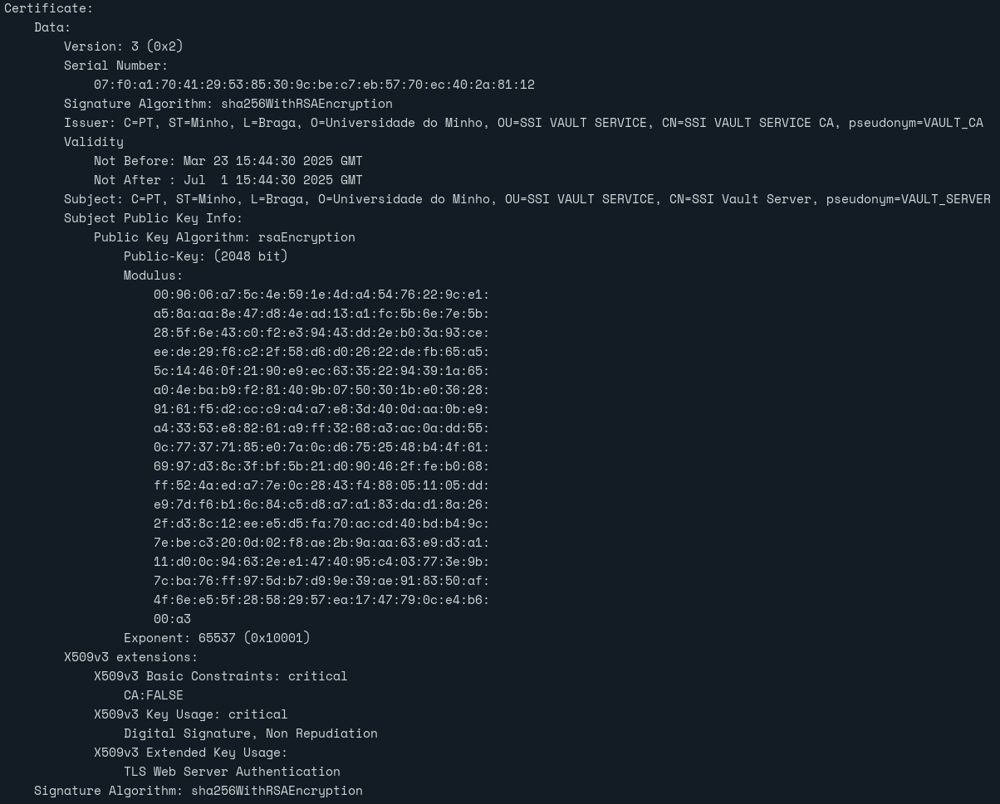

# Resposta da Questão

## QUESTÃO 1: * Como pode verificar que as chaves fornecidas nos ficheiros mencionados (por exemplo, em MSG_SERVER.key e MSG_SERVER.crt) constituem de facto um par de chaves RSA válido?

Para afirmar que o par de chaves é valido é necessário verificar se o valor do módulo RSA da chave privada e o valor do módulo RSA da chave pública são iguais. Para esse efeito podemos executar o seguinte comando `openssl verify -CAfile VAULT_CA.crt VAULT_SERVER.crt` que produz o seguinte output:

## QUESTÃO 2: * Visualize o conteúdo dos certificados fornecidos, e refira quais dos campos lhe parecem que devam ser objecto de atenção no procedimento de verificação. 

Primeiramente devemos olhar para o campo **Subject** que indica a entidade a quem o certificado foi emitido, podendo assim garantir que a entidade corresponde à que se pretende validar. Utilizando o campo **Issuer** obtemos a autoridade certificadora (CA) que emitiu o certificado, podendo assim garantir a sua fiabilidade. 

Em seguida o campo **Validity** que define o período de tempo onde o certificado é válido tendo uma data de início e uma data de fim.

Devemos ainda analisar o algoritmo de assinatura (**Signature Algoritm**) e garantir que o algoritmo utilizado não é fraco e/ou desatualizado. 

**Key Usage** e **Extended Key Usage** definem os propósitos para os quais o certificado está a ser utilizado (neste caso *Critical*  e *TLS Web Server Authentication*, respetivamente).

Por fim, o campo **Subject Alternative Name (SAN)** indica outros domínios ou subdomínios para os quais o certificado é válido.

Abaixo é apresentado o output do comando `openssl x509 -text -noout -in VAULT_SERVER.crt`

